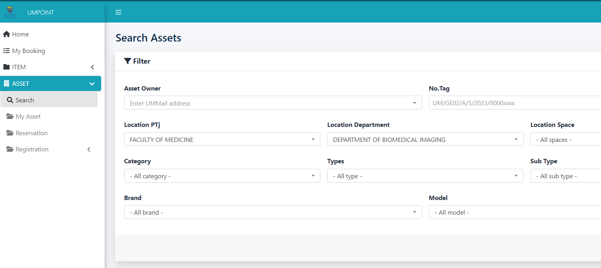

# Zac Fashion

**Zac Fashion** is an e-commerce website built using the Laravel framework, MySQL database, and modern front-end technologies. The goal of this project is to deliver a user-friendly online platform where customers can seamlessly browse and purchase fashion products.

---

## 🚀 Project Overview

Zac Fashion is designed to provide an engaging and smooth online shopping experience with features such as product browsing, search and filtering, shopping cart, and a secure checkout process.

### **Key Features**

- **User Registration & Authentication:**  
  Secure sign-up and login for customers.

- **Product Browsing:**  
  Users can view products by category, search, and filter by price or brand.

- **Shopping Cart:**  
  Add, update, or remove products from the cart.

- **Order Management:**  
  Place orders and view order history.

- **Admin Dashboard:**  
  Manage inventory, products, categories, and customer orders.

- **Responsive Design:**  
  Optimized for mobile and desktop devices.

---

## 🛠️ Tech Stack

- **Backend:** Laravel 9 (PHP 8.2+)
- **Database:** MySQL 8.0
- **Cache/Sessions:** Redis
- **Frontend:** Vite, Tailwind CSS, Alpine.js, Blade templating
- **Containerization:** Docker, Docker Compose
- **Web Server:** Nginx (production), Caddy (development via Sail)
- **Payment:** Stripe
- **Other:** Responsive design, Admin panel, Multi-vendor support

---

## 📸 Screenshots

<!-- Add your screenshots here -->
<p align="center">
  
  <br>
  
  <br>
  
</p>

---

## ⚙️ Setup & Installation

### Option 1: Docker (Recommended)

The project includes Docker configurations for both development and production environments following industry best practices.

#### Development Environment (Laravel Sail)

```bash
# 1. Clone the repository
git clone https://github.com/ZachroyAnazfitry/zac-fashion.git
cd zac-fashion

# 2. Copy .env file
cp .env.example .env

# 3. Start Docker containers
docker compose -f compose.dev.yaml up -d

# 4. Install dependencies (inside container)
docker compose -f compose.dev.yaml exec laravel.test composer install
docker compose -f compose.dev.yaml exec laravel.test npm install

# 5. Generate application key
docker compose -f compose.dev.yaml exec laravel.test php artisan key:generate

# 6. Run migrations and seeders
docker compose -f compose.dev.yaml exec laravel.test php artisan migrate --seed

# 7. Access the application
# Open http://localhost in your browser
```

#### Production Environment (Nginx + PHP-FPM)

```bash
# 1. Build and start production containers
docker compose -f compose.prod.yaml up -d --build

# 2. Run migrations
docker compose -f compose.prod.yaml exec php-fpm php artisan migrate --force

# 3. Optimize for production
docker compose -f compose.prod.yaml exec php-fpm php artisan config:cache
docker compose -f compose.prod.yaml exec php-fpm php artisan route:cache
docker compose -f compose.prod.yaml exec php-fpm php artisan view:cache
```

📖 **For detailed Docker documentation, see [DOCKER.md](DOCKER.md)**

### Option 2: Traditional Setup

```bash
# 1. Clone the repository
git clone https://github.com/ZachroyAnazfitry/zac-fashion.git

# 2. Install dependencies
cd zac-fashion
composer install
npm install

# 3. Copy .env file and set your environment variables
cp .env.example .env

# 4. Generate application key
php artisan key:generate

# 5. Run migrations and seeders
php artisan migrate --seed

# 6. Start the development server
php artisan serve

# 7. (Optional) Compile frontend assets
npm run dev
```

---

## 📝 Usage

1. Register as a new user or log in.
2. Browse products, add them to your cart, and proceed to checkout.
3. Admin users can access the dashboard to manage products, inventory, and orders.

---

## 👨‍💻 Contributing

Contributions are welcome! Please open an issue or pull request for suggestions, bug reports, or improvements.

---

## 📄 License

This project is licensed under the [MIT License](LICENSE).

---

## 💡 Acknowledgments

- Laravel Documentation
- Open Source Community

---

**Project by [ZachroyAnazfitry](https://github.com/ZachroyAnazfitry)**
